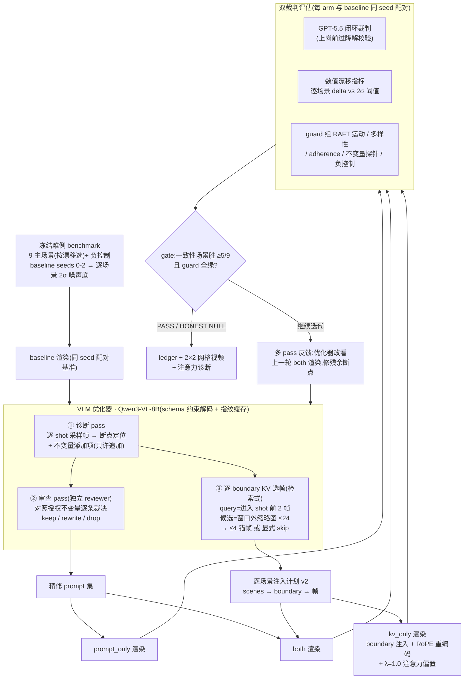

# 长多镜头视频跨 Shot 一致性:当前方法论

2026-07-02 · 分支 `feat/multiview-consistency` · 代码入口:`scripts/run_round17_vlm_loop.py`(编排)、`scripts/run_vlm_closed_judge_ablation.py`(单轮消融)、`utils/kv_rag.py`(KV 注入)

**问题定义**:自回归视频扩散模型生成长多镜头视频时,注意力只覆盖最近的局部窗口,早期 shot 建立的主体身份/场景布局会随镜头切换漂移。我们研究**免训练**的推理期干预:能否用一个 VLM agent 在生成过程中(a)改写文本条件、(b)决定把哪些历史帧的 KV 重新注入当前注意力窗口,来抑制跨 shot 漂移。

## 流程总览



---

## 1. 生成基底

- **模型**:Wan2.2-TI2V-5B 因果视频扩散(`configs/inference_kv_rag_long_multishot.yaml`),480 潜帧 = 60 block × 8 帧,24fps 解码约 20 秒。
- **局部注意力**:`local_attn_size=32` 帧——生成第 t 帧时模型只能看到最近 32 帧,任何早于此的内容对模型不可见,这是漂移的结构性根源,也是 KV 注入的作用空间。
- **多镜头结构**:每场景 6-8 个 shot,由 `shot_durations.txt` 定义(典型 `12 12 6 6 6 6 6 6` block);每个新 shot 在文本前缀加场景切换标记,`multi_shot_sink` 把开头帧钉为注意力汇,`multi_shot_rope_offset` 按 shot 平移 RoPE 相位。
- **Prompt 协议**:每场景 `global.json`(全局 caption + `invariant_caption` 不变量 + `contrast_caption` 反例)+ 逐 shot `N.json`(镜头/动作 caption)。全局 caption 前置到每个 shot 的条件文本。

## 2. 干预方法一:VLM Prompt 精修(带独立审查门)

**机制**(两次独立 VLM 调用,均为本地 Qwen3-VL-8B / SGLang):

1. **诊断 pass**:优化器观看被诊断视频的逐 shot 采样帧(每 shot 4 帧,均匀采样),输出 JSON:哪个切点破坏了一致性(`which_cut_broke`)、全局不变量**添加项**、逐 shot **添加项**。约束:只允许**追加**主体/场景不变量,禁止删改镜头/动作描述,禁止把 shot 文本改到彼此雷同;诊断 prompt 中硬性规定"渲染结果与授权不变量矛盾时,矛盾是待修缺陷——重申授权,永不把渲染出来的样子固化成指令"。
2. **审查 pass**(角色切换为 reviewer,不是 author):对照授权的 global/invariant caption 逐条裁决每个添加项——`keep`(与授权一致或使其更锐)/ `rewrite`(与授权矛盾 → 改写为重申授权)/ `drop`(无关或压缩多样性)。裁决与理由全部落账。
3. 通过审查的添加项以 `"Added invariant: ..."`(全局)和 `"Maintain invariant: ..."`(逐 shot)追加进 prompt 副本,供 `prompt_only`/`both` arm 渲染。

**为什么需要审查门**:优化器看的是有漂移的渲染,天然倾向描述"看到的"而非"应该的";单遍生成会把漂移固化成指令(实测案例:把 baseline 幻觉出的人物写进纯物景的全局不变量)。作者/审查者分离是 humanize 框架 pair-code + independent review 的直接移植。

**收益**:文本侧不变量强化不再引入自我矛盾;审查粒度是逐条添加项,误伤率低(Round 18:34 条添加 33 keep / 1 rewrite / 0 误杀);所有改动可审计、可回放。

## 3. 干预方法二:Agentic KV 选帧注入(检索式)

这是本工作的核心贡献:把"往注意力窗口里回灌哪些历史帧"从启发式(固定取最近帧/开头帧)变成**逐切点的内容检索决策**。

```
                  ◄──────────── 历史帧(模型已不可见)────────────►   ◄─ live window(32帧)─►
 时间轴  shot0            shot1            shot2         shot3        │ shot4 生成中…
        ├────────────────┼────────────────┼─────────────┼────────────┼─────────────────►
 候选池   ▫  ▫  ▫  ▫  ▫  ▫   ▫  ▫  ▫  ▫  ▫    ▫  ▫  ▫  ▫    ▫  ▫       │  (每 shot 采 8 帧缩略图,
          └──────────── 仅取窗口外的帧,均匀子采样至 ≤24 ───────────┘   │   frame < boundary−32)
                             │                                        │
                             ▼   VLM 检索(每个 boundary 一次调用)      │
              query = shot4 开头 2 帧  +  候选缩略图(带 C0..Cn 标签)   │
              → 按画面内容选 ≤4 锚帧(或显式 skip,须给理由)            │
                             │                                        │
                             ▼                                        ▼
              [f_a, f_b, f_c] ──KV 注入:RoPE 重编码 + λ·logit bias──► 当前注意力窗口
                                        (attention-mass 落账,作为操纵检查)
```

**选帧机制**(每个 shot boundary 一次独立 VLM 调用):

- **候选池**:每 shot 均匀采 8 帧缩略图,只保留位于活跃注意力窗口之外(`frame < boundary_start − 32`)的帧——保证注入的是模型此刻**看不见**的信息;每个 boundary 的候选帧上限 24 张(均匀时间子采样,首尾必留)。
- **Query**:进入该 shot 的前 2 帧,即"接下来要与谁保持一致"。
- **决策**:VLM 按画面内容从候选中选 ≤4 帧(`kv_anchor_cap=4`),要求理由点名所选帧展示了什么(主体面部/服饰/纹理、场景布局);明确指令"早的帧不自动更好";允许显式 `skip`(须给理由)。每个 boundary 都有显式决策,无静默遗漏。
- **净化**:选帧结果 snap 到合法候选、去重、封顶;全部偏差落账。

**注入机制**(`utils/kv_rag.py`,生成期):

- 逐场景计划(manual plan v2:`scenes → {boundary → [帧]}`)在推理时按样本名解析——每个场景注入的就是为它选的帧;查不到才退回全局兜底计划。
- 在每个 shot boundary,被选帧的 KV 条目以 `boundary` 调度注入当前窗口(`scene_memory_rolling`,`max_entries=64`,帧对齐存储 `frame_aligned_store` + `reinject_rope` 重编码位置)。
- **注意力偏置**:持久锚列加 `λ=1.0` 的 logit bias——对症于此前诊断出的"注入的锚被模型降权 4-20 倍"现象;`attention_diagnostic` 记录锚列的实际注意力质量作为操纵检查(manipulation check),用于区分"注入不够"与"注入了也没用"。

**收益**:选帧表现出真实检索行为——60 个 boundary 计划含 34 种独立帧集、52/60 使用中段帧(启发式和旧实现只会堆积开头帧),进入后段 shot 的 boundary 选择紧邻切点的帧;λ=1.0 下锚注意力质量 0.041(λ=0 时 0.017,×2.4),偏置确实到达注意力层;首个越过配对噪声底的数值增益出现在此 arm(见 §6)。

## 4. 干预方法三:组合(both)

精修后的 prompt + 同一份逐场景 KV 计划同时生效。文本强化不变量的"应然",KV 注入提供像素级的"实然"参照——两者作用通道不同(条件文本 vs 注意力内容),组合检验是否互补。

## 5. 评估方法论

**冻结难例 benchmark**(`example/benchmark_hard_multishot/`,版本化):

- 9 个主场景按 baseline 漂移(seed0,480 帧)从高到低选取(0.61→0.45),排除接近指标天花板的易场景——保证任何方法有可测的提升空间;
- 其中 2 个场景专门围绕人物精细特征编写(胡须/眉毛/痣/眼镜;纹身/耳环/头巾),针对"整帧 embedding 指标看不见细节"的假说;
- 1 个自相矛盾场景带 `negative_control: true` 标记:在它上面"一致性赢且无 adherence 损失"= 文本覆盖作弊的证据,永远不算方法胜利;
- 全部场景带 invariant/contrast caption,使不变量对比探针可用。

**配对与统计口径**:

- 所有 arm 与 baseline **同 seed 配对**,唯一变量是干预本身;
- 每场景的胜出阈值 = **2σ 跨 seed 噪声底**(seeds 0-2 的 baseline 漂移标准差 ×2,逐场景冻结:最灵敏 0.018,最噪 0.135)——"赢"必须超过同场景的随机波动,不用全局固定阈值;
- gate 判定:一致性场景胜数 ≥5/9,且全部 guard 通过。

**双裁判 + 反作弊 guard**:

- **数值指标**:`anchor_drift_aggregate_consistency`(DINO 主体流 + CLIP 背景流的 to-first / worst-to-first 漂移敏感聚合)——刻意不用会把对称漂移平均掉的 centroid 类指标;
- **闭环裁判**:GPT-5.5(codex OAuth,与优化器完全独立)对每 shot 1 帧的 fixture 打分(subject/background/逐 shot adherence/切点诊断/作弊 flag),裁判本身先过降解校验(subject-swap 必须掉分、copy-cheat 必须被 flag、纯视角变化不得误伤)才允许上岗;
- **guard 组**:RAFT 相对运动(防冻结)、inter-shot 多样性下限(防复制粘贴)、CLIP prompt adherence 容差(防文本覆盖)、不变量对比探针、prompt 文本相似度下限(防 shot 文本坍缩)、合成降解负控制(复制帧序列必须被裁判 flag);
- 结论只有三态:PASS(过 gate 且 guard 全绿)/ HONEST NULL(渲染成功但未过)/ BLOCKED(前置条件未满足,不出结论)。

**收益**:任何单一评审的失效模式都被另一方覆盖——裁判的粗粒度反作弊漏掉的多样性/运动塌缩由数值 guard 拦,数值指标看不见的细节改善由裁判补;两者在同一场景上**同向**时,证据强度质变(Round 18 首次出现,2 个场景)。

## 6. 多轮编排与可复现性

- **多 pass 反馈环**:第 2 轮起优化器观看**上一轮 both arm 的渲染**(`--multi_pass_watch_arm`),诊断残余断点、增量改 prompt / 重选锚帧;评估口径始终对 baseline 配对不变。第 N 轮修的是第 N−1 轮没修好的,而非重复诊断同一输入。
- **结构化输出**:所有 VLM 调用带 JSON Schema,SGLang 约束解码保证语法合法(不支持时自动降级为解析重试);`schema_enforced`/`parse_attempts` 落账。
- **内容指纹缓存**:每次 VLM 调用的转录以 SHA256(模型+prompt 文本+有序图像哈希+schema)为键,断点续跑只复用指纹完全一致的调用;`optimizer_config.json` 标记保证 `--resume` 不会跨配置脏复用;渲染层按条(per-stem)续渲。
- 每轮产物:ledger(判定+理由链)、逐场景 4-up 网格视频(2×2:baseline|prompt_only / kv_only|both,切点标记)、优化器决策与转录、注意力诊断。

## 7. 当前实证状态(Round 18,seed0,gate 判定 NULL)

| arm | 数值场景胜(2σ,需 5) | 裁判场景胜 | 关键数据 |
|---|---|---|---|
| prompt_only | 1/9 | 5/9(均值 δ −0.02) | 裁判过线但数值不支持 |
| **kv_only** | **3/9** | 3/9(δ −0.008) | 锚注意力质量 0.041(λ=0 的 2.4×) |
| both | 2/9 | 3/9(δ −0.001) | 与 kv_only 高度重合 |

- **首次出现越过配对噪声底的数值胜利**(此前所有轮次为 0):kv_only 在 brown_bear_river(+0.082/阈 0.073)、sandy_beach_driftwood(+0.069/0.045)、african_savanna(+0.019/0.018);
- **首次裁判-数值同向**:brown_bear_river(裁判 0.61→0.67)与 sandy_beach_driftwood(0.62→0.70)两把尺子一致;
- **诚实的反例**:两个人物细节场景未受益(noodle_chef 裁判视角 kv 反而 0.76→0.66)——当前 KV 注入的收益模式是"主体清晰的自然场景",细节假说暂未获支持;
- 负控制与全部 guard 通过,增益不来自作弊通道。

**开放问题 / 计划中的检验**:① seeds 1-2 配对复验(3 个胜利是否是 seed 噪声);② 多 pass 第 2 轮的边际增益;③ λ∈{0,1,2} 扫描分离"选帧"与"偏置"贡献;④ 数值指标的 subject masking + ArcFace 升级(裁决人物场景上裁判-数值分歧);⑤ token/region 级 KV 选择(注入主体区域而非整帧)。
