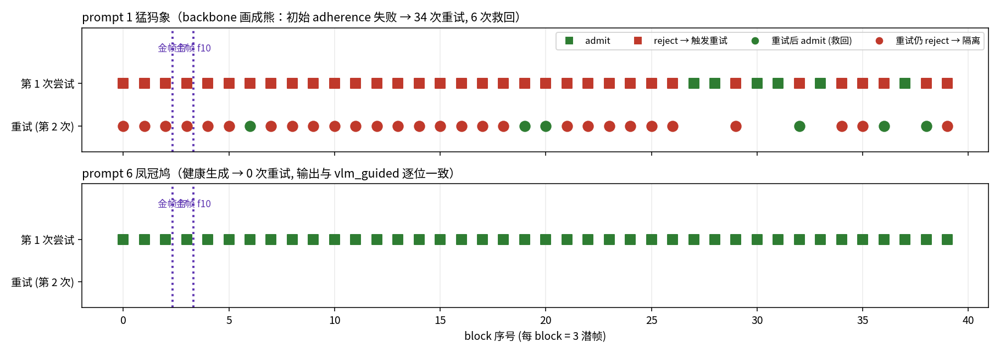
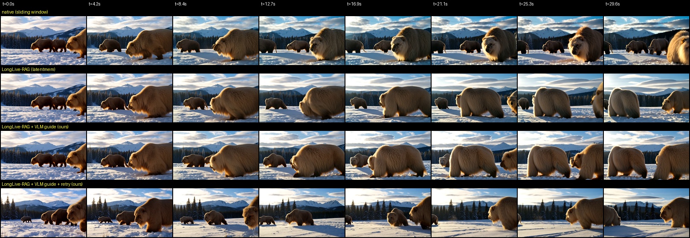
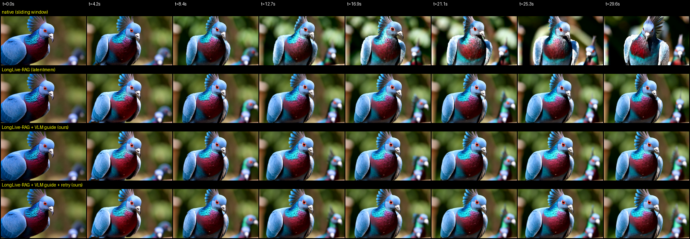
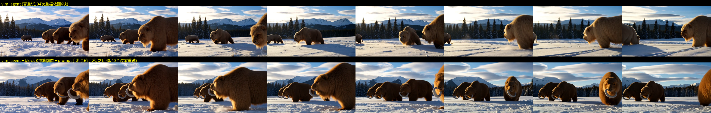
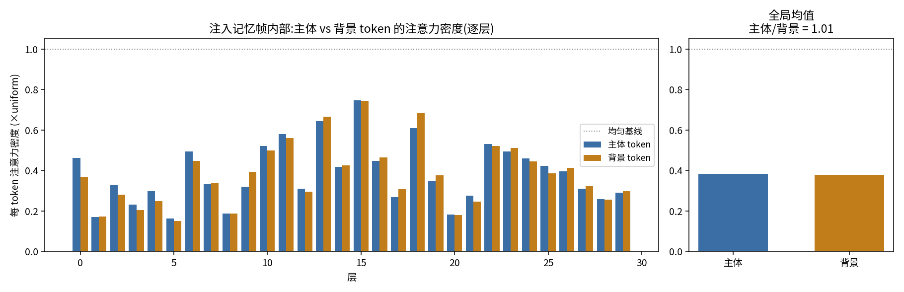
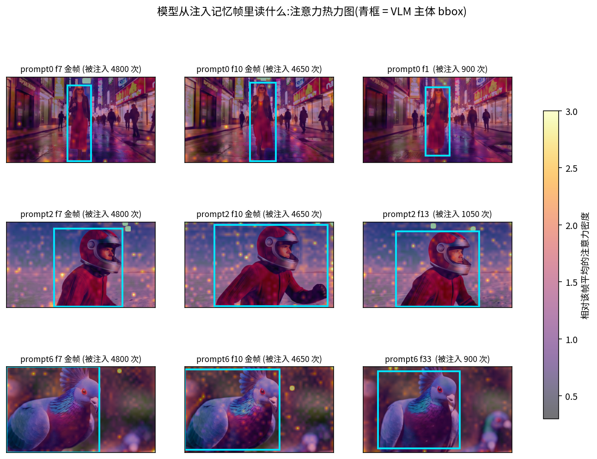
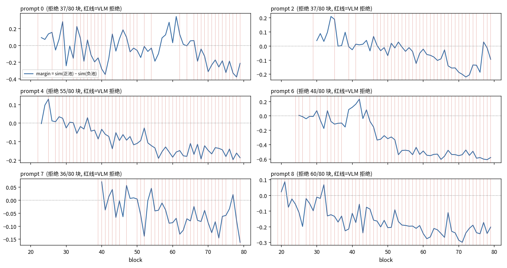

# 用 VLM 引导 LongLive-RAG 的检索记忆:同 shot 实验记录

2026-07-23,分支 `feat/multiview-consistency`。短版方法总结与实验计划见 [SUMMARY.md](SUMMARY.md)。基于 [LongLive-RAG](https://github.com/qixinhu11/LongLive-RAG) (arXiv 2606.02553) 的官方代码和权重做的一组实验,目的是搞清楚:在它的设定(单 prompt 连续长视频)下,把检索决策交给 VLM 能不能比它训练出来的检索器做得更好。

## 起因

之前我们在多镜头设定下测到,追加进注意力的异源 KV 会被降权 4-20 倍,基本推不动画面。但 LongLive-RAG 在单 prompt 连续生成上是有正收益的,所以先拿探针量了一下它的注入通道(8 个 prompt,120 潜帧,30 层全测,原始数据在 `code/attnmass_longlive_8x120.json`)。结果是检索记忆 token 占了上下文的 49%,拿到 19% 的注意力,也就是每 token 大约 0.40 倍均匀基线。有降权,但比跨镜头轻一个量级,而且 19% 的绝对量足够影响生成了。

读代码时发现一个论文里没写的细节:他们把检索回来的帧 re-RoPE 到相对位置 0,跟 sink 同相位。LongLive 的 backbone 是带 frame-sink 训练的,本来就学会了盯着位置 0 看,所以这些注入条目相当于伪装成了 sink,躲开了 recency 压制。这解释了为什么他们的降权比我们温和。

结论是同 shot 下追加注入这条通道是通的,问题不在"模型看不看",在"检索器选得对不对"。它的检索有三个毛病:query 用的是当前内容的 embedding,一旦画面漂了,检回来的就是和漂移状态最像的历史,越漂越锚定漂移;记忆池来者不拒,坏块照收照检;生成出坏块也没有任何补救。这三件事都不是"更准地找相似"能解决的,因为"相似"本身就不是对的标准——需要的是有语义判断的验收和参照选择,这正好是 VLM 能做、embedding 检索器做不了的。

## 做法

在他们的 pipeline 上加了三个 VLM 干预,注意力代码一行没动,全部改动都在 `memory_indices` 的选择逻辑里(diff 见 `code/upstream_patch.diff`):

每个 block(3 潜帧)生成完之后,解码两帧低清缩略图给本地 Qwen3-VL-8B 裁决,输出 subject_ok / appearance_ok / quality_ok 三项,都过才 admit。prompt 里明确要求只在清晰失败时拒绝,运动模糊、视角变化这类正常波动不算。

- admit 的块,KV 和检索描述子进记忆池。第 4 个 block 之后 VLM 从已通过的帧里选两帧"金帧"(主体最清楚、最贴 prompt 的),此后每次检索的 6 个槽位里,2 个固定给金帧,剩下 4 个照旧走相似度 top-k,但只在 admit 过的池子里检;
- reject 且是第一次尝试,就回滚到 block 开始前的 KV 快照(30 层 K/V、CPU 池、索引指针、描述子都恢复),换一份噪声重新生成,再裁决一次。每个 block 最多重试一次;
- 重试还不过,就 quarantine:视频照常输出,但这个块的帧不进记忆池,不让错误变成后面的参照。

跑了四个 arm,同 seed 同噪声配对,逐级叠加:

- **native**:LongLive 本体,纯滑窗,无检索——底线;
- **latentmem**:+ 检索记忆,即 **LongLive-RAG 论文方法原样跑**(名字沿用他们代码里的配置名 latent memory;VLM 只打标不干预,保证四个 arm 算力对等);
- **vlm_guided**:latentmem + 我们的准入门和金帧;
- **vlm_agent**:vlm_guided + 失败重试。

用他们的 benchmark prompt(MovieGenBench refined,选了 0/1/2/6 四条主体明确的),120 潜帧约 30 秒,LongLive backbone + LoRA 官方 checkpoint,指标用他们论文的 VBench 六维 + Avg. Rank。

## 结果

| arm | subject | background | motion | dynamic | aesthetic | imaging | Avg. Rank |
|---|---|---|---|---|---|---|---|
| native(LongLive 滑窗) | 0.9274 | 0.9380 | 0.9890 | 0.50 | 0.6717 | 67.14 | 2.54 |
| latentmem(= LongLive-RAG) | 0.9377 | 0.9459 | 0.9894 | 0.50 | 0.6692 | 68.80 | 2.42 |
| vlm_guided(ours) | 0.9360 | 0.9487 | 0.9894 | 0.50 | 0.6650 | 69.61 | 2.21 |
| vlm_agent(ours) | 0.9403 | 0.9450 | 0.9887 | 0.75 | 0.6810 | 69.50 | 2.83 |

**检索有没有用(latentmem vs native)**:subject 0.9377 vs 0.9274,background、imaging 也都更高。有用,重现了他们论文的主张,顺带证明我们的复现环境没问题。

**VLM 选择比训练检索器好吗(vlm_guided vs latentmem)**:六维里三赢两平一输,Avg. Rank 2.21 vs 2.42;另外用 CLIP 算的末段到首帧一致性,四条 prompt 全赢但幅度只有 0.004-0.011。方向为正,不构成强结论。

**重试值不值(vlm_agent vs vlm_guided)**:这组读法不同——三条健康 prompt 上 agent 一次重试都没触发,输出和 vlm_guided 逐位相同,所以两行的全部差异只来自猛犸那一条。在那条上 agent 的 subject 最高、唯一 dynamic 非零、aesthetic 最高。

dynamic degree 那列需要单独解释:其他 arm 在猛犸和凤冠鸠上是 0.0,意思是视频基本静止,而静止画面天然刷高一致性分(帧帧一样)。VBench 设这个维度就是为了抓"靠不动作弊"。所以 agent 在猛犸上"画面真的在动 + subject 还最高"是全表含金量最高的格子,但要同时看两列才能看出来。至于它的 Avg. Rank 垫底,是被 motion smoothness 上 0.0007 的差距拖的——排名不管差距大小,四条 prompt 全给它记了三四名。n=4 时排名很脆,分维度原始分更可信。

最有意思的是猛犸那条 prompt。backbone 从第一个 block 就画成了熊,VLM 40 个 block 全拒了,理由都是"Bears shown, not mammoths"。重试救回来 6 块,剩下 28 次重试白花——块级重摇治不了 backbone 根本画不出猛犸这件事,这类失败该升级去改 prompt 或者重启,不是记忆操作能救的。但有个意外收获:看下面的时间线,block 27 之后第一次尝试开始零星通过了。救回来的那几块"比较像猛犸"的内容进了记忆池,被检索回去之后把后面的生成也带正了一点。准入和重试是有复利的。

下排是健康场景(凤冠鸠),零重试,输出和 vlm_guided 逐位一致——快照回滚机制确认不污染正常路径。

视觉对比,四行从上到下是 native / latentmem / vlm_guided / vlm_agent:

猛犸场景里 agent 是唯一 dynamic degree 非零的 arm(其他三个都是靠画面几乎不动刷一致性分),同时它这条的 subject consistency 还是四个 arm 里最高的。画面从"草地上两只熊"变成了"雪松林前一群长毛兽",朝 prompt 靠了不少。视频:[prompt1](videos/prompt001_4arms.mp4)。

凤冠鸠这条,native 到 30 秒畸变成了两只鸟,检索的三个 arm 都稳,guided/agent 末段和开场贴得最紧。视频:[prompt6](videos/prompt006_4arms.mp4)。另外两条:[东京女子](videos/prompt000_4arms.mp4)、[宇航员](videos/prompt002_4arms.mp4),对应条带图在 figures/ 里。

## 该打的折扣

四条 prompt、单 seed、30 秒,这只是方向性证据。缺两个对照:不用 VLM 的静态版本(比如启发式选金帧、embedding 离群值过滤做准入),用来隔离 VLM 的净贡献;以及等算力的盲重采。准入门在 30 秒的健康场景里一次都没触发,想展示记忆污染效应得跑更长。重试现在是整块重摇,对"外观漂了"这种失败来说太粗,白白丢掉运动信息。

## 下一步

主要是把动作做细。VLM 的裁决本来就是分维度的,动作也应该分级:quality 崩了才重摇;appearance 漂了应该走原位 V-edit(把窗口内主体区域 token 的 V 向金帧原型插值,主仓库已经验证过这条通道,保运动且几乎不花钱);主体丢了先试金帧 KV 强注入加 logit bias;连续几个 block 双拒同一个理由就停止重试,升级出内环。另外重试应该带引导(至少把金帧强制塞进重试 block 的检索槽,或者从上一个好块的末帧加噪起步),金帧该有淘汰更新机制,VLM 裁决可以异步化——recent_exclude=5 意味着块被逐出后要等 5 个 block 才可检索,裁决晚到一两个 block 完全来得及。

## 追记(2026-07-30):把猛犸画出来

上面猛犸场景的失败模式是条件层的:backbone 对 "wooly mammoth" 先验太弱,同一条 prompt 下怎么换噪声都往熊塌,34 次盲重试只有 6 次命中(约 18%)。但账本里有两条线索:重试偶尔真能摇出猛犸(说明概念不是完全没有),以及救回的块进池后带正了后面的生成(说明只要开头对,后面跟着对)。据此加了两级升级:

1. **block-0 预算前置**:主体是在第一个 block 定型的,所以 block 0 给 6 次重摇预算(此时记忆池还是空的,没有熊往回拉),后面的 block 维持 1 次;
2. **prompt 手术**:block 0 预算耗尽且全是 subject 失败(画质失败不触发),pipeline 提前中止,VLM 拿着"实际画成了什么"的证据帧改写 prompt——要求把主体扩写成判别性解剖特征、把生僻概念挂靠到模型熟悉的相近概念上——然后从头重启,至多两轮。

结果:block 0 六次重摇全拒(确认是先验问题不是运气),手术一轮,改写把 "woolly mammoths" 扩成了 "massive columnar bodies, thick pillar-like tusks curving outward, shaggy layered fur..."(VLM 自己的措辞),重启后 **40/40 个 block 首次尝试全部通过,零重试**。对比原来的 34 次重摇救 6 块,命中率 18% → 100%,总算力反而更省。

上排是盲重试版(熊),下排是手术版:长弯象牙全程保持(金帧锚在维持),分层长毛、群体行进都对上了。视频:[前后对比](videos/prompt001_surgery.mp4)。

没解决的部分也要记:象鼻还是没画出来,鼻子仍是短的——"带牙的长毛巨兽"离标准猛犸还差一步,这是 1.3B backbone 的概念极限,文本层救不动,属于第三级(外部参照注入:用画得出猛犸的 T2I 模型出参照帧,VAE 编码后 teacher-force 成首帧,参照帧天然就是金帧)的活,还没做。

这个实验的通用意义比猛犸本身大:失败类型和干预层级对上了——采样问题用重摇(前置预算),文本可救的先验问题用 prompt 手术,文本救不动的用参照注入,三级构成一个由裁决结果驱动的升级链,每级的失败就是下一级的触发条件。

## 追记(2026-07-30):模型从注入记忆里读什么——区域探针

在做 token 级 KV 选择之前,先量了一个决定方向的问题:注入记忆帧拿到的那 ~19% 注意力,落在帧内的什么地方?是主体区域在扛,还是摊在背景上?做法是让裁决调用顺带返回主体 bbox(同一次 VLM 调用,零新增开销),映射到 30×52 的 token 网格,把探针的 mem 区域拆成主体/背景两半再量(3 条健康 prompt × 120 帧 × 30 层,15300 条记录)。

结果很干净:**主体与背景的每 token 注意力密度之比是 1.01**(逐 prompt: 1.12 / 0.93 / 1.00)。逐层看,30 层里没有任何一层偏好主体,最吃记忆的 13/15/18 层也是平摊。热力图上注意力在注入帧内部近乎均匀铺开,bbox 内外看不出密度差。

这一个数同时解释了两个此前独立的观察:vlm_guided 在 VBench 上赢的是 background consistency 而非 subject(模型从注入帧里读的本来就是场景统计量);以及主仓库 noodle_chef 反例里整帧注入救不了人物细节(不是信息没给,是模型不优先读主体)。它也裁决了 token 级选择的方向:**纯"只注入主体 token"不是免费优化**——那会拿掉模型实际在读的约三分之二内容(背景),有伤 background consistency 的风险;要让主体被读到,选择必须配上引导注意力的机制。

## 下一步计划

按优先级排,每一项都带判定标准:

1. **区域级 logit bias**(最先做):只给注入帧的主体 token 列加 λ∈{1,2} 的注意力偏置(主仓库 persistent_logit_bias 的区域版)。判定分两层:机制层用同一个区域探针复测,主体密度比应从 1.01 显著抬升;效果层在 4 条 prompt + 3-stage 转身集上同 seed 对比,看 subject consistency 是否上去、background consistency 是否守住。机制层抬不动就直接放弃这条,转原位 V-edit;
2. **预算重组**:保留 2 张整帧金帧管场景,另加 4-6 个不同姿态的主体 token 包管身份(等 token 预算对照:整帧 6 帧 vs 2 整帧+N 主体包)。与方案 1 正交,可组合;
3. **区域级准入**:裁决已分维度,配 bbox 做部分准入(主体漂了只禁主体 token,背景漂了只禁背景)。选错的代价只是少存记忆,是 token 级决策里风险最低的,适合与 1/2 并行;
4. **层级门控**:探针数据显示 layer 1/5/8/20 基本不消费记忆,注入时跳过这些层,纯省钱,顺手做;
5. **升级链第三级(外部参照注入)**:猛犸的象鼻问题——用画得出该概念的 T2I 模型出参照帧,VAE 编码 teacher-force 成首帧,参照帧即金帧。这同时是"自检索记忆 → 外部参照库"的第一个用例;
6. **扩量与对照**(发表前必做):16-32 prompts × 3 seeds;补两个静态对照(启发式金帧、embedding 离群准入——后者同时是 Stream-T1 质量门的复刻)和等算力盲重采;Stream-T1 进 baseline。

远一点的:把手写升级链换成 Controller(把工具箱、账本、成本表给 VLM,让它自己提动作并预测效果),和手写链对跑——检验"agent 是否过度依赖人的 heuristic"那个问题;以及把这里验证过的选择机制搬回主仓库 Wan2.2-5B 的跨镜头设定,与原位 V-edit 配对。

## 追记(2026-07-30):负记忆(error buffer)的离线验证

想法:quarantine 现在只是把被拒块挡在池外,什么都不留。把被拒块的描述子存成负 buffer,后续块算一个 margin = sim(正池) − sim(负池),margin 塌缩就是"正在滑向已知失败模式"的预警——不用逐块调 VLM。

验证方式是 observe 模式重放:生成时 VLM 只打标不干预,离线模拟在线池(截至 t−1 块的正/负池),检验 margin 能否预测第 t 块的标签。第一轮就翻车了,而且翻得有信息量:12 条 60 秒 observe(latentmem 6 条 + native 6 条)**全部单一标签**——健康 prompt 全过,熊全拒。原因不是视频没坏(native 的凤冠鸠后段冒出多只鸟、颜色全漂,见 figures/pigeon_progression.jpg),而是**绝对式裁决对渐进漂移是盲的**:"这段画面本身有无清晰失败"抓得住灾难,抓不住漂移,因为漂移只有对比早期参照才可见。改成对比式重打标(给参照帧问"相对开场漂了没有",缩略图都在,离线重标不用重新生成)后立刻拿到干净的分级标签:凤冠鸠 0-23 块 none、24 块起 mild、45 块后连续——教科书式的漂移相变。

用漂移标签做验证(6 条 native × 80 块,319 个双池非空的可评估块):

| 信号 | AUC |
|---|---|
| margin = sim(正池) − sim(负池) | **0.787** |
| 只用负池距离 | 0.756 |
| 只用正池距离(无负记忆对照) | 0.605 |

负记忆把 AUC 从 0.605 抬到 0.787,增量明确;margin 用 AE 描述子、标签来自 VLM 看像素,两个空间独立,不是循环论证。时间线图(figures/fig_negmem_margin.png)里凤冠鸠的 margin 恰好在标签转为连续漂移的 block 45 陡降。

三个结论:margin 预警 guard 可用(支撑 VLM 异步化——margin 塌了才调 VLM 确认);**裁决要分双层**——绝对式管灾难(触发重试/手术),对比式管漂移(触发准入/负记忆),现在生产 gate 只有前者,这解释了为什么 30 秒健康场景准入门零触发;保留意见是 AE 空间对负簇不友好(熊负簇内聚仅 0.338,Delta Loss 故意打散相邻内容),重试预过滤那一步要在语义 embedding 上再验一版。

据此在上面的计划里插两项:对比式准入门改造(排在区域 logit bias 之后)和 margin guard 上线(与 VLM 异步化合并做)。

## 复现

`code/` 里是全部材料:对上游的 diff、VLM 客户端、四臂 driver、注意力探针和它的实测数据、VBench 原始分、条带图脚本。VLM 服务用 sglang 起:`python -m sglang.launch_server --model-path Qwen/Qwen3-VL-8B-Instruct --port 30000`。未压缩的完整产物(逐 block 缩略图、原始分辨率视频、全部账本)在本机 `videos/vlm_guided_sameshot_20260723/`,没入库。
