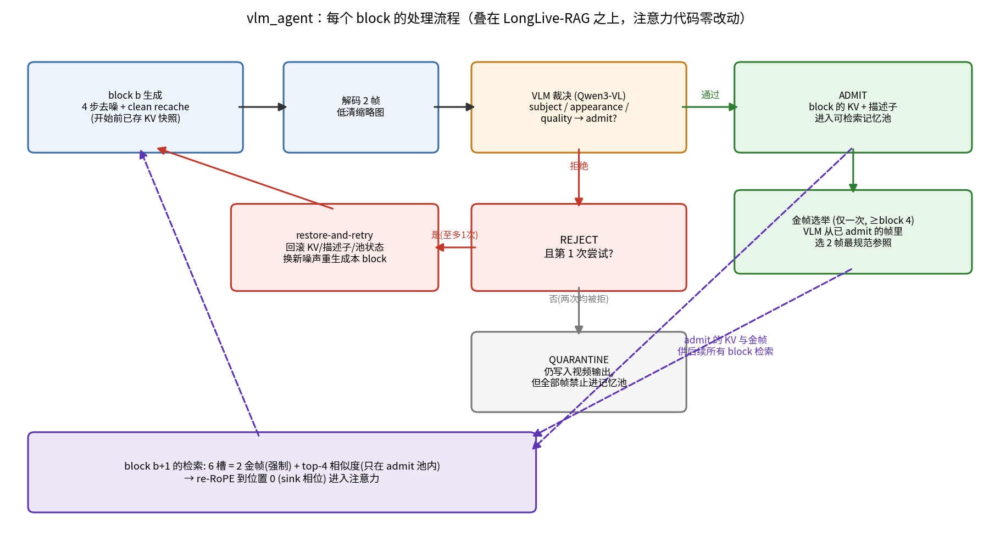

# 方法总结:给流式视频生成加一个会看画面的裁判

2026-07-30。这是短版,完整实验过程在 [README.md](README.md)。

## 这是什么

流式视频生成器(我们用的是 LongLive + LongLive-RAG 的检索记忆)生成长视频时,错误会积累:主体慢慢变样,场景慢慢跑偏,偶尔从第一帧就画错东西。模型自己没有任何机制发现这些,因为它的记忆——不管是滑窗还是检索——都是不加分辨地照单全收:画坏的内容照样进记忆,被检索回来,变成后面生成的参照。

我们做的事情是在生成器外面套一个环。每生成一小段(3 潜帧),就解码两帧缩略图给一个本地 VLM 看,让它判断这段内容对不对。判断的结果有三个去处:内容没问题,它的 KV 就进检索池,供后面参考;有问题,就回滚 KV 快照、换个噪声重来一次;重来还不行,这段照常出现在视频里,但它的记忆被扣下,不许污染后面。在这之上还有两个小机制:VLM 会在开头选两帧"金帧"钉进每次检索(利用了一个实测发现——他们把检索帧注入在 sink 相位,那是注意力里唯一不被时近性压制的位置);被拒内容的特征存成负池,后面哪块的特征开始靠近负池、远离正池,就是漂移预警,不用每块都请 VLM。

失败严重的时候环会升级。换噪声重摇几次都是同一个错,说明不是运气问题,是模型对这个概念的先验不行——这时 VLM 拿着"它实际画了什么"的证据去改写 prompt,从头再来。猛犸那条 prompt 是最好的例子:模型从第一块就画成熊,盲重摇 34 次只救回 6 块;换成"重摇几次确认是先验问题→改写 prompt 强调长牙和柱状腿→重启"之后,40 块全部一次通过。

整套东西不训练任何参数,不改注意力代码,生成器完全冻结。它的出处其实是代码 agent 的那套工作方式——测试门控、独立审查、隔离区、失败升级——搬到了视频生成器的内部状态上。区别在于代码的验证有 ground truth(测试跑过就是过),我们的裁判是个会犯错的 VLM,所以裁判本身的可靠性在这里是个正经问题,不是工程细节。

## 现在知道什么

在他们自己的 benchmark 和指标(VBench 六维)上,加了裁判的版本 Avg. Rank 2.21,原版 2.42;带重生成的版本在 subject consistency、dynamic degree、aesthetic 三项上最高,而且健康内容上一次重试都没触发、输出和不带重生成的版本逐位一致——环是无害的,只在出事时才花钱。

比数字更有用的是三个机制测量。注入的记忆在同 shot 下确实被消费(拿到 19% 的注意力,约 0.4 倍均匀线),所以这个设定下追加注入是条通路——跨镜头就不是了,那边降权 4 到 20 倍,得用原位改写。但模型消费注入帧的方式是无差别的:主体和背景 token 的注意力密度之比是 1.01,它读的是场景统计量,不是主体身份——这解释了为什么收益集中在背景一致性,也说明想修身份光"选得准"没用,得配注意力引导或者直接改 V。负池的 margin 信号预测漂移的 AUC 是 0.787,只用正池是 0.605,error buffer 确实带来了正池给不了的信息。做这个验证时还撞出一个意外发现:让 VLM 判断"这段画面本身有没有问题"抓不住漂移——凤冠鸠后段冒出好几只鸟它照样放行——必须给它参照帧问"相对开场变了没有"。裁决得分两套:绝对式抓灾难,对比式抓漂移。

顺带说明:主仓库验证过的 V-edit 到现在还没用上,这边所有干预都是检索槽操纵、重摇和改文本。V-edit 是下一步的事。

## 别人做到哪了

离我们最近的是 Stream-T1(arXiv 2605.04461),同一个 backbone、同一个 benchmark,也在 chunk 级做质量控制,KV 层面也有个质量门。但它的判分是标量奖励模型——一条画面精美的熊视频在它那里是高分,"画错了东西"这种语义失败它看不见;它没有文本干预,没有回滚,搜索是每块常开的 beam(不管内容健不健康都花 K×M 倍算力)。VISTA、VQQA 那批 VLM 反馈改 prompt 的工作和我们的手术像,但都是外环——整条视频生成完再批评重来,我们在流内第一块就拦。记忆一致性那条线(Context as Memory、WorldMem)检索都按几何或相似度,没有人验收记忆。真正的结构祖先在代码 agent 文献里:Voyager 的技能库只收验证过的技能,就是我们的准入门;Reflexion 存教训,就是负池;过程监督加回溯,就是块级裁决加 KV 回滚。

## 接下来

近期三件事。第一,把静态对照跑了。这个实验回答的问题是:收益到底来自"有门、有锚"这个机制本身,还是来自守门的是个会看语义的 VLM?准入、金帧、重试这套机制完全可以由便宜的数值规则驱动——标量奖励低于移动平均就禁入池(这恰好就是 Stream-T1 质量门的设计,所以静态臂顺便就是它的复刻),清晰度启发式选金帧,奖励阈值触发重试。如果静态版拿到一样的分,"VLM 语义判断带来收益"这个主张就不成立,只剩"验收机制带来收益"。VLM 该赢的地方也明确:标量奖励看不见的语义失败——画面精美的熊视频在美学奖励上是高分。

具体设计:七个臂(native / latentmem / static_guided / vlm_guided / static_agent / vlm_agent / 等算力盲重采),同 seed 配对;prompt 分两层——健康层 8 条 + 语义失败层 8 条(生僻概念、人物细节、3-stage 转身),各 3 seeds。要出四张表:

| 表 | 内容 | 回答什么 |
|---|---|---|
| T1 | 臂 × VBench 六维 + Avg Rank,两层分开报 | 总体格局;预期健康层 static≈vlm |
| T2 | 臂 × 两层的实体级指标(subject-masked 一致性,人物加 ArcFace),配逐场景 2σ 噪声底 | 主判定表——整帧指标对身份不敏感(区域探针已证),胜负在这里定 |
| T3 | static vs vlm 配对的门行为对账:拒绝率、放行的语义失败数(离线对比式复核)、检索污染率、金帧盲评、每块判分成本 | 解释 T2 差距的来源:静态门漏放了什么 |
| T4 | 臂 × 去噪次数 / 判分成本 / 墙钟 | "同算力"前提可审计;顺带展示触发式 vs 常开的成本差 |

预注册判定:vlm 版须在语义失败层的 T2 上以 ≥2σ 胜对应静态版,健康层允许打平;语义失败层也打平的话,结论改写为机制贡献,VLM 主张撤回。

第二,区域 logit bias:给注入帧的主体 token 加偏置,用区域探针看那个 1.01 能不能被抬起来;抬得动就接着测实体级指标,抬不动就说明追加加引导这条路到头,转 V-edit(主仓库已验证的通道,负池原型差正好给它当方向约束)。第三,把对比式裁决和 margin 预警接进生产 gate——margin 塌了才请 VLM,裁决晚一两个块也来得及,因为块被逐出后要等五个块才可检索,这个时间窗白送的。

发表前要补的:完整协议(128 条 prompt、30/60/120 秒、3 seeds、他们论文的三个 backbone),等算力盲重采对照,Stream-T1 进 baseline。还有一个和 Stream-T1 的路线对比值得单独做:同预算下它的常开 beam 对我们的触发式升级链,预期健康内容上打平但我们便宜好几倍,语义失败上我们独赢——一张表画清楚两条路线的边界。

更远的两件。一是把手写的升级链换成 Controller:工具箱、账本、成本表都给 VLM,让它自己提动作、预测效果、事后对账,看它能不能自己发现"重摇不行就改 prompt"这条链——这回应的是"这个 agent 是不是太依赖人的 heuristic"的问题,ADAS 和 AFlow 那批工作说明这个方向可行。二是把整套 gate 和账本搬回主仓库的跨镜头设定,和 V-edit 配对——那边追加通道是死的,原位改写是唯一验证过的路,而这边攒出来的裁决、准入、负池,正好是 V-edit 一直缺的"什么时候改、往哪改、改完认不认"。
